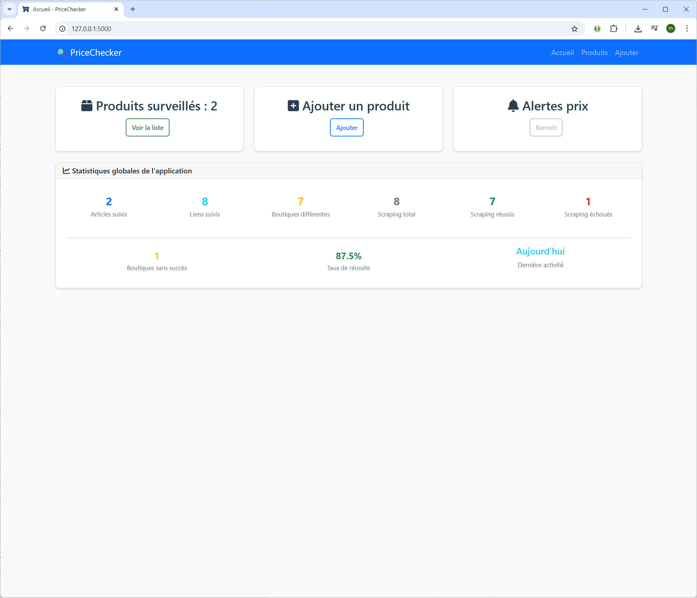
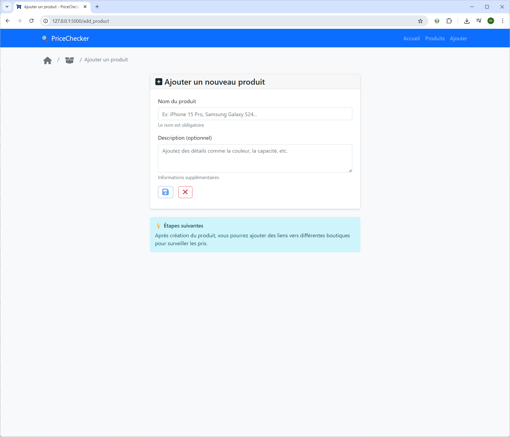
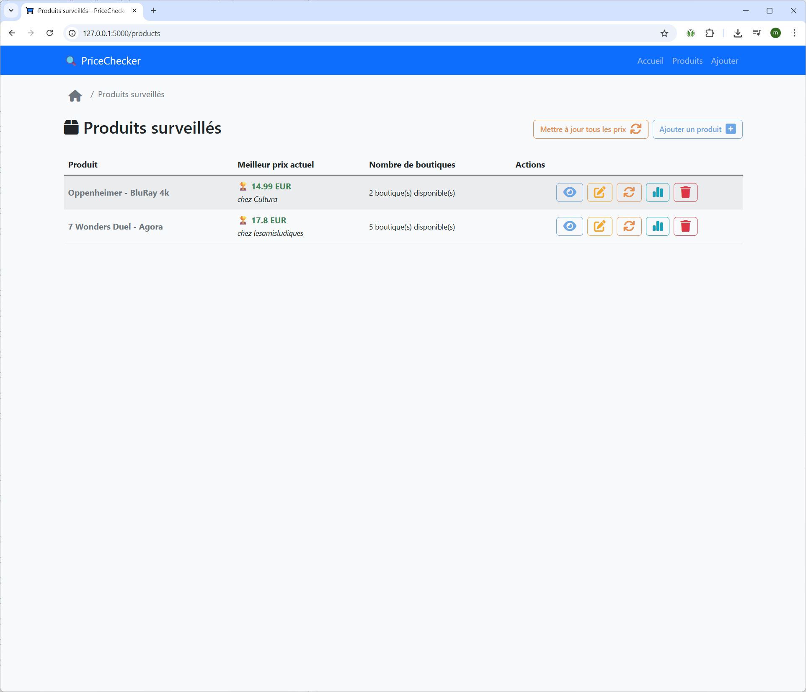
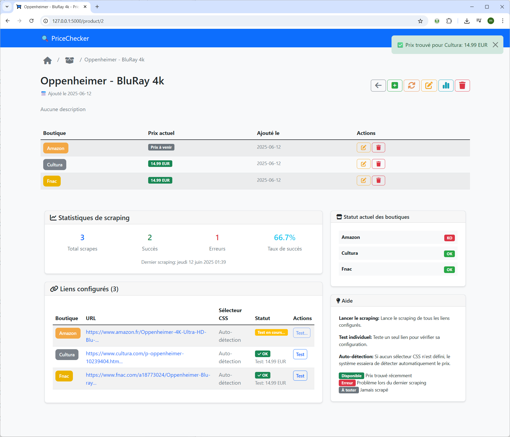
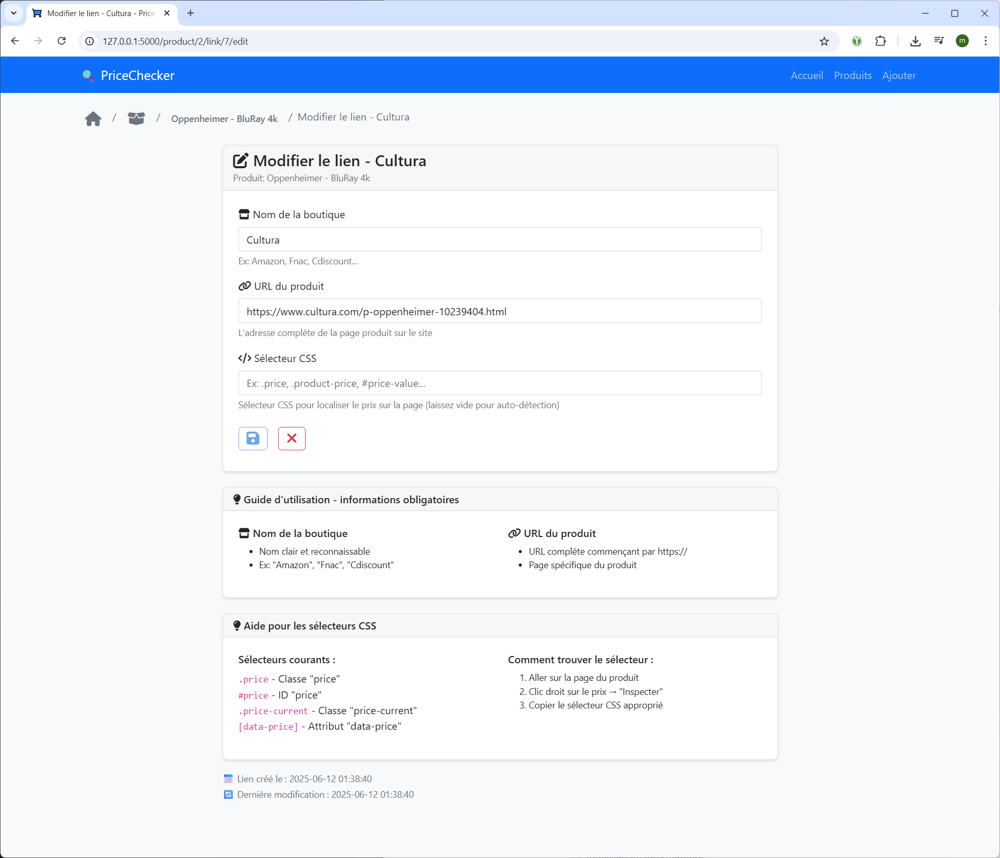
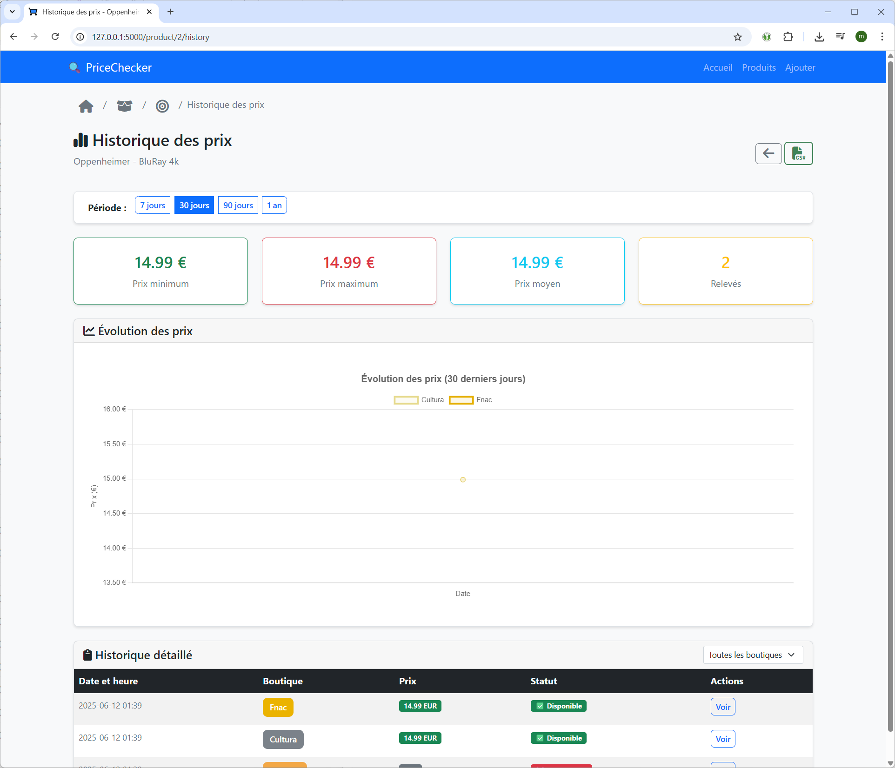

# 🏷️ PriceChecker

**Application web de surveillance automatique des prix en ligne**


## 📋 **Description**

PriceChecker permet de surveiller automatiquement les prix de produits sur différents sites e-commerce. L'application scrape les prix, conserve un historique détaillé et offre une interface moderne pour gérer vos surveillances.

## ✨ **Fonctionnalités**

### 🎯 **Gestion des produits**
- ➕ Ajout de produits avec validation
- ✏️ Modification des informations
- 🗑️ Suppression sécurisée
- 🔗 Gestion multi-boutiques

### 📊 **Surveillance des prix**
- 🕷️ Web scraping automatisé (BeautifulSoup + Selenium)
- 📈 Historique complet des prix
- 📉 Graphiques interactifs (Chart.js)
- 📧 Export CSV des données

### 🎨 **Interface utilisateur**
- 📱 Design responsive (Bootstrap 5)
- 🎭 Icônes FontAwesome
- ⚡ Animations CSS fluides
- 🔄 Feedback temps réel

### 🔧 **API REST**
- 📥 Endpoints JSON complets
- 🧪 Tests automatisés
- 📋 Validation des données

### 🗃️ **Base de données**
- 🗂️ Initialisation automatique

## 🏗️ **Architecture technique**

```
├── 🌐 Frontend: HTML5, CSS3, JavaScript ES6
├── ⚙️ Backend: Flask 3.0, SQLite3
├── 🕷️ Scraping: BeautifulSoup4, Selenium
├── 📊 Charts: Chart.js, Moment.js
└── 🧪 Tests: pytest, coverage
```
## 📸 **Screenshots de l'application**
🖱️ Cliquez pour voir toutes les captures d'écran
<details>

### **Page d'accueil**
<div>
  <a href="docs/screenshots/01-accueil.png" target="_blank">
    
  </a>
</div>

### **Ajout d'un produit**
<div>
  <a href="docs/screenshots/02-ajoutproduit.png" target="_blank">
    
  </a>
</div>

### **Liste des produits**
<div>
  <a href="docs/screenshots/03-listeproduits.png" target="_blank">
    
  </a>
</div>

### **Détail d'un produit**
<div>
  <a href="docs/screenshots/04-detailproduit.png" target="_blank">
    
  </a>
</div>

### **Edition d'un lien de boutique**
<div>
  <a href="docs/screenshots/06-editionlien.png" target="_blank">
    
  </a>
</div>

### **Historique d'un produit**
<div>
  <a href="docs/screenshots/05-historiqueproduit.png" target="_blank">
    
  </a>
</div>

</details>


## 🚀 **Installation**

### Prérequis
- Python 3.13+
- pip
- 🐧 python3-venv 
- 🐧 git
- 🐧 curl
- 🐧 wget
- 🐧 chromium-chromedriver (ou firefox-geckodriver pour Firefox)

### **Méthode rapide (Windows 🪟)**
Télécharger le projet puis exécuter les commandes suivantes :

```batch
# Installation automatique
install.bat

# Démarrage
start.bat
```

### **Installation manuelle (Windows 🪟, Linux 🐧, MacOS 🍏)**
```bash
# 1. Cloner le projet
git clone <repository-url>
cd PriceChecker

# 2. Créer l'environnement virtuel
python -m venv .venv
source .venv/bin/activate  # Linux/Mac
# ou
.venv\Scripts\activate     # Windows

# 3. Installer les dépendances
pip install -r requirements.txt

# 4. [OPTIONNEL] Initialiser la base de données
python -c "from database.models import init_db; init_db()"

# 5. [OPTIONNEL] Mise à jour de pip
pip install --upgrade pip

# 6. Lancer l'application
python run.py
```

### **Accès à l'application**
🌐 Ouvrir : `http://localhost:5000`

## 📁 **Structure du projet**

```
PriceChecker/
├── 📂 app/                     # Application Flask
│   ├── 📂 templates/          # Templates Jinja2
│   ├── __init__.py            # Factory app
│   └── routes.py              # Routes & API
├── 📂 database/               # Base de données
│   └── models.py              # Modèles SQLite
├── 📂 scraping/               # Web scraping
│   ├── 📂 scrapers/           # Scrapers spécialisés
│   └── price_scraper.py       # Scraper principal
├── 📂 static/                 # Assets statiques
│   ├── 📂 css/               # Styles personnalisés
│   ├── 📂 js/                # JavaScript
│   └── 📂 images/            # Images & favicon
├── 📂 utils/                  # Utilitaires
│   ├── display_helpers.py     # Helpers templates
│   └── validators.py          # Validation données
├── 📂 tests/                  # Tests unitaires
├── 📂 logs/                   # Fichiers de logs
├── config.py                  # Configuration
├── run.py                     # Point d'entrée
└── requirements.txt           # Dépendances
```

## 🗃️ **Base de données**

### **Schéma SQLite :**
```sql
📋 products          # Produits surveillés
├── id (PK)
├── name             # Nom du produit
├── description      # Description
└── created_at       # Date création

🔗 product_links     # Liens boutiques
├── id (PK)
├── product_id (FK)
├── shop_name        # Nom boutique
├── url              # URL produit
├── css_selector     # Sélecteur prix
└── created_at

📊 price_history     # Historique prix
├── id (PK)
├── product_link_id (FK)
├── price            # Prix récupéré
├── currency         # Devise
├── is_available     # Disponibilité
├── error_message    # Erreur éventuelle
└── scraped_at       # Date scraping
```

## ⚙️ **Configuration**
Le fichier de configuration est `config.py`.

### **Variables d'environnement :**
```bash
# Application
SECRET_KEY=your-secret-key-here
DEBUG=False
HOST=0.0.0.0
PORT=5000

# Base de données
DATABASE_PATH=./pricechecker.db

# Scraping
SCRAPING_DELAY=2
MAX_RETRIES=3
TIMEOUT=30
USER_AGENT=PriceChecker/1.0
```

### **Configuration scraping :**
```python
# config.py
SCRAPING_CONFIG = {
    'delay_between_requests': 2,    # Délai entre requêtes (secondes)
    'timeout': 30,                  # Timeout requête (secondes)
    'max_retries': 3,              # Nombre de tentatives
    'user_agent': 'Custom Agent',   # User-Agent personnalisé
}
```

## 🧪 **Tests**

```bash
# Tests complets avec couverture
python -m pytest tests/ --cov=app --cov=database --cov-report=html

# Tests spécifiques
python -m pytest tests/test_models.py -v
python -m pytest tests/test_routes.py -v
python -m pytest tests/test_scraping.py -v

# Détection code mort
vulture . --exclude=.venv,.git,__pycache__
```

## 📊 **API Documentation**

### **Endpoints principaux :**
```http
# Produits
GET    /api/products              # Liste produits
POST   /api/products              # Créer produit
GET    /api/product/{id}          # Détail produit
GET    /api/product/{id}/links    # Liens produit

# Prix et historique
GET    /api/product/{id}/price-chart    # Données graphique
GET    /api/product/{id}/price-stats    # Statistiques
POST   /api/link/{id}/test-scraping     # Test scraping

# Validation
POST   /api/validate/product-name       # Valider nom
POST   /api/validate/url               # Valider URL
```

### **Exemple réponse API :**
```json
{
  "status": "success",
  "data": {
    "id": 1,
    "name": "iPhone 15",
    "prices": [
      {
        "shop_name": "Apple",
        "price": 799.00,
        "currency": "EUR",
        "is_available": true,
        "scraped_at": "2024-01-15T10:30:00Z"
      }
    ]
  }
}
```

## 🛠️ **Développement**

### **Ajouter un scraper personnalisé :**
```python
# scraping/scrapers/nouveau_site.py
def scrape_nouveau_site(url, css_selector=None):
    """Scraper pour nouveau site"""
    # Votre logique ici
    return {
        'price': 29.99,
        'currency': 'EUR',
        'is_available': True,
        'error_message': None
    }
```

### **Commandes utiles :**
```bash
# Formatage du code
black app/ database/ utils/

# Linting
flake8 app/ database/ utils/

# Nettoyage base de données
python -c "from database.models import cleanup_old_prices; cleanup_old_prices()"
```

## 🐛 **Résolution de problèmes**

### **Erreurs courantes :**

| Erreur | Cause | Solution |
|--------|-------|----------|
| `Database locked` | SQLite en cours d'utilisation | Redémarrer l'app |
| `403 Forbidden` | User-Agent détecté | Changer USER_AGENT |
| `Template not found` | Chemin incorrect | Vérifier TEMPLATES_PATH |
| `Import Error` | Module manquant | `pip install -r requirements.txt` |

### **Logs et debugging :**
```bash
# Consulter les logs
tail -f logs/app.log

# Debug mode
export DEBUG=True
python run.py
```

## 🔮 **Roadmap v3.0**

### **Fonctionnalités à venir :**
- [ ] 🔐 Authentification multi-utilisateurs
- [ ] ✳️ Tags et catégories de produits
- [ ] 📧 Notifications email/Slack (seuil automatique ou paramétrable)
- [ ] 📈 Statistiques avancées
- [ ] 🌍 Support multi-langues
- [ ] 🔁 Import/export base de données
- [ ] 📦 Sauvegarde automatique (Google Drive, S3, etc.)
- [ ] 📊 Page "boutiques"
- [ ] 👑 Page d'administration
- [ ] 💰 Achat optimisé
- [ ] 🔎 Filtres
- [ ] 🌐 Sélection du scraper
### **UX/UI :**
- [ ] 🖌️ Refonte de l'interface/Quality of Life
- [ ] 🎨 Nouveau thème sombre
- [ ] 📱 Application mobile (React Native)
### **Maintenance :**
- [ ] 🧹 Factorisation, Nettoyage code obsolète
- [ ] 🗑️ Nettoyage base de données
- [ ] 🔄 Mise à jour dépendances
- [ ] 📦 Mode Production
- [ ] 📦 Mode Développement (hot-reload, debug)
- [ ] 🧪 Implémentation de logs
- [ ] 🧪 Tests unitaires
### **Techniques :**
- [ ] 🔐 Implémentation de principes de sécurité (CSRF, XSS, etc.) 
- [ ] ❌ Gestion des erreurs
- [ ] 🐍 Migration vers Python 3.11
- [ ] 🤖 API webhooks
- [ ] 📦 Application autonome
- [ ] 🐳 Conteneurisation Docker
### **Documentation :**
- [ ] 📖 Documentation utilisateur/administrateur
- [ ] 📖 Documentation API
- [ ] 📚 Guide de contribution

## 🧪 Tests ##
L'application est censée fonctionner sur Linux, Windows et macOS.
Le plan de test est divisé en trois parties :
1. **🔧 Plan de Tests Techniques** : Teste le code de l'application
2. **📦 Plan de Tests de Déploiement Système/Application** : Teste les scripts d'installation et le déploiement de l'application
3. **⚡ Plan de Tests Fonctionnels** : Teste les fonctionnalités de l'application

Les tests peuvent être :
- **⏳ A faire** : Le test n'est pas encore implémenté ou n'a pas été lancé
- **❌ Echoué** : Le test a échoué (mais ne bloque pas l'application)
- **✅ Validé** : Le test est validé

### 🔧 Plan de Tests Techniques ###

_À faire_

### 📦 Plan de Tests de Déploiement Système/Application ###

#### 🐧 Linux ####
##### 🍥 Debian/Ubuntu #####
Script d'installation : `install_debian.sh`

Statut général : **✅ OK**

L'application fonctionne et est opérationnelle.

Détails :

| Option                                   | Statut de développement | Attente                                          | Statut de test |
|------------------------------------------|-------------------------|--------------------------------------------------|----------------|
| `Vérification sudo`                      | Implémenté ✅            | Éjecte l'utilisateur s'il n'est pas sudo ou root | ✅              |
| `Mise à jour système`                    | Implémenté ✅            | Met à jour les paquets système                   | ✅              |
| `Pull Github`                            | Implémenté ✅            | Récupère la dernière version du dépôt github     | ✅              |
| `Création venv`                          | Implémenté ✅            | Crée un environnement virtuel python3            | ✅              |
| `Installation pip`                       | Implémenté ✅            | Installe le gestionnaire de paquets pip          | ✅              |
| `Installation des prérequis`             | Implémenté ✅            | Installe les paquets requis                      | ✅              |
| `Installation Gunicorn`                  | Implémenté ✅            | Installe gunicorn                                | ✅              |
| `Déploiement Gunicorn`                   | Implémenté ✅            | Déploie gunicorn                                 | ✅              |
| `Utilisation Gunicorn`                   | Implémenté ✅            | Utilise gunicorn                                 | ✅              |
| `Python3-Dev`                            | Implémenté ✅            | Installe Python3-Dev                             | ✅              |
| `Installation HTML5Lib`                  | Implémenté ✅            | Installe HTML5Lib                                | ✅              |
| `Déploiement HTML5Lib`                   | Implémenté ✅            | Déploie HTML5Lib                                 | ✅              |
| `Utilisation HTML5Lib`                   | Implémenté ✅            | Utilise HTML5Lib                                 | ⏳              |
| `Installation Chromium`                  | Implémenté ✅            | Installe Chromium et ses dépendances             | ✅              |
| `Déploiement Chromium`                   | Implémenté ✅            | Déploie Chromium                                 | ✅              |
| `Utilisation Chromium`                   | Implémenté ✅            | Utilise Chromium                                 | ⏳              |
| `Installation Firefox`                   | Implémenté ✅            | Installe Firefox et ses dépendances              | ✅              |
| `Déploiement Firefox`                    | Implémenté ✅            | Déploie Firefox                                  | ✅              |
| `Utilisation Firefox`                    | Implémenté ✅            | Utilise Firefox                                  | ⏳              |
| `Méthode sans scraping`                  | Implémenté ✅            | Utilise la méthode de scraping intégrée          | ✅              |
| `Suppression base de données par défaut` | Implémenté ✅            | Supprime la base de données par défaut           | ⏳              |
| `Configuration du service`               | Implémenté ✅            | Configure le service avec toutes les options     | ✅              |
| `Activation du service`                  | Implémenté ✅            | Active le service                                | ✅              |
| `Personnalisation de la configuration`   | Implémenté ✅            | Personnalise la configuration de l'application   | ✅              |
| `Édition de la configuration`            | Implémenté ✅            | Édite le fichier de config (manuellement)        | ⏳              |
| `Configuration des logs`                 | Implémenté ✅            | Crée le répertoire des logs                      | ✅              |
| `Démarrage du service`                   | Implémenté ✅            | Démarre l'application via le service             | ✅              |
| `Démarrage autonome de l'application`    | Implémenté ✅            | Démarre l'application en mode autonome           | ⏳              |

#### 🪟 Windows ####
Script d'installation : `install.bat`

Statut général : **✅ OK**

L'application fonctionne et est opérationnelle.

Détails :

| Option                                | Statut de développement | Attente                                 | Statut de test |
|---------------------------------------|-------------------------|-----------------------------------------|----------------|
| `Création venv`                       | Implémenté ✅            | Crée un environnement virtuel python3   | ⏳              |
| `Installation pip`                    | Implémenté ✅            | Installe le gestionnaire de paquets pip | ⏳              |
| `Installation des prérequis`          | Implémenté ✅            | Installe les paquets requis             | ⏳              |
| `Méthode sans scraping`               | Implémenté ✅            | Utilise la méthode de scraping intégrée | ⏳              |
| `Démarrage autonome de l'application` | Implémenté ✅            | Démarre l'application en mode autonome  | ⏳              |

#### 🍏 macOS ####

📋 _À faire_

### ⚡ Plan de Tests Fonctionnels ###

📋 _À faire_

## 📞 **Support et contribution**

- 🐛 **Issues** : [GitHub Issues](repository-url/issues) **COMING SOON**
- 📧 **Email** :  **COMING SOON**
- 📖 **Documentation** : [Wiki](repository-url/wiki) **COMING SOON**
- 💬 **Discussions** : [GitHub Discussions](repository-url/discussions) **COMING SOON**

## 🔒 Licence et droits d'auteur

### GNU General Public License v3.0

Ce logiciel est distribué sous la licence GNU GPL v3.0. 

**Cela signifie que :**
- ✅ Vous pouvez utiliser ce logiciel gratuitement
- ✅ Vous pouvez modifier le code source
- ✅ Vous pouvez redistribuer le logiciel
- ⚠️ **OBLIGATION** : Toute modification ou distribution doit inclure le code source
- ⚠️ **OBLIGATION** : Les œuvres dérivées doivent également être sous GPL v3.0
- ⛔ **INTERDICTION** : Utilisation dans des logiciels propriétaires fermés

### Copyright
- ~~Copyright © 2024 PriceChecker Project~~
- Ce programme est un logiciel libre : vous pouvez le redistribuer et/ou le modifier selon les termes de la Licence Publique Générale GNU telle que publiée par la Free Software Foundation, soit la version 3 de la Licence, ou (à votre option) toute version ultérieure.
- Ce programme est distribué dans l'espoir qu'il sera utile, mais SANS AUCUNE GARANTIE ; sans même la garantie implicite de COMMERCIALISATION ou d'ADÉQUATION À UN USAGE PARTICULIER. Voir la Licence Publique Générale GNU pour plus de détails.

**Texte complet de la licence :** [LICENSE](LICENSE) | [GNU GPL v3.0](https://www.gnu.org/licenses/gpl-3.0.html)

---

**Développé avec ❤️ en Python & Flask**